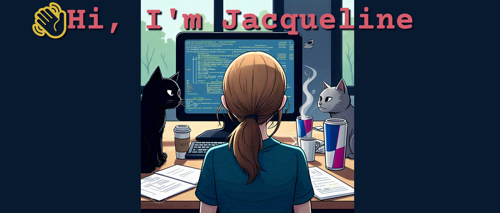

### I'm a **Full Stack Developer** focused on automating and optimizing processes.

## 🌐 Visit [My Website](https://jtrapp18.github.io/my-interactive-portfolio)

## 🚀 Skills & Technologies:
- **Languages:** Python, JavaScript, SQL, HTML, CSS, VBA
- **Tools:** Git, AWS, MySQL
- **Frameworks:** React, Flask

## 🔗 Connect with Me:
- [LinkedIn](https://www.linkedin.com/in/jacqueline-trapp)
- [Hashnode](https://hashnode.com/672903e59b3903ff579fbdcd/dashboard)

## 📚 Featured Projects:

### 🐝 [Hive Link](https://hive-link.up.railway.app)
Platform for beekeepers to track hive inspections, analyze honey production, predict hive health, and connect with other beekeepers through maps, forums, and events.
- **Technologies**: CSS, React, Python, Flask, SQL
- [Repo](https://github.com/jtrapp18/hive-link)

### 🏠 [Rental Management Tool](https://github.com/jtrapp18/rental_management_tool)
A Python-based CLI tool to manage rental units, tenants, and payments.  
- **Technologies**: Python
- [Repo](https://github.com/jtrapp18/rental_management_tool)

### 🌍 [Wandr Personal Travel Journal](https://jtrapp18.github.io/wandr-personal-travel-journal)
A React-based travel journal for documenting travels and creating itineraries.  
- **Technologies**: CSS, React
- [Frontend Repo](https://github.com/jtrapp18/wandr-personal-travel-journal) | [Backend Repo](https://github.com/jtrapp18/wandr-personal-travel-journal-be)

### 🍪 [J&N Cookies](https://j-n-cookies-production.up.railway.app)
Mock online cookie store where users can browse cookies, manage carts, and review orders.
- **Technologies**: CSS, React, Python, Flask, SQL
- [Repo](https://github.com/jtrapp18/j-n-cookies)

### 📚 [Curriculum Management Dashboard](https://jtrapp18.github.io/english-study-curriculum-mgmt)
A dashboard for managing English study curriculums and student progress.  
- **Technologies**: CSS, HTML, JavaScript
- [Frontend Repo](https://github.com/jtrapp18/english-study-curriculum-mgmt)

---
